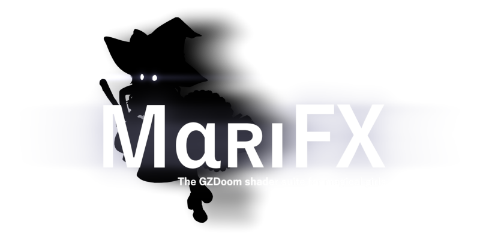

Various fancy shaders for GZDoom.

Included:
 - Luma Sharpen.
 - Color Grading suite.
 - Color Matrix.
 - Hue-Saturation.
 - BlurSharpShift.
 - Film Grain.
 - Screen Dirt.
 - Vignette.
 - Palette reduction+dither from RetroFX (has doom, heretic, hexen and strife palettes).
